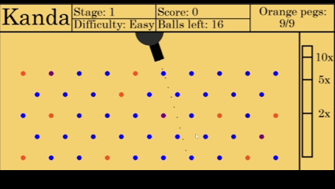

# Kanda
*A Peggle-inspired game built with Python and Pygame*

A short arcade-style puzzle game built as part of my sixth-form coursework in 2023, featuring multiple levels, user profiles, and a local leaderboard.

Kanda is a peggle-inspired game where you use the mouse to aim and shoot a cannon at various pegs.
Hitting all of the orange pegs clears a stage but the challenge comes when you only have a limited amount of balls to shoot.

[Demo Video](https://www.youtube.com/watch?v=CzNTPqsLNLI)

[Full Playthrough Video](https://www.youtube.com/watch?v=vwQNdqV7tqk)

## Features
- Mouse-controlled aiming and shooting
- There are three stages
- The menu and the three stages each have theme music that plays
- The volume can be controlled via the settings menu that can either be accessed by the pause menu or the main menu
- For each stage you can pick between easy, medium and hard
- Local user system with automatic score saving
- Leaderboard that tracks high scores
- Multiple ways to increase your score:
  - Peg hits (blue = low, purple = high)
  - Bonus for unused balls
  - Difficulty multipliers
  - Orange pegs bonus multiplier applied

## Controls
- Move mouse to aim
- Left-click to shoot

## Installation
**Option 1: Play instantly**
- [Download the game on Itch.io](https://rosenrgd.itch.io/kanda)

**Option 2: Run locally**
1. Clone this repository  
2. Install pygame
3. Run the Kanda.py file

## Built With
- Python
- Pygame

## Credits
- Game design and programming by Evan Jarvis
- All tracks can be found [here](https://www.void1gaming.com/platformer-music-pack-lite)
- Tracks used are:
  - Menu Music: Sunset by the Lake
  - Stage 1: Sunny Sands
  - Stage 2: Starlit Skies
  - Stage 3: No Stopping Now
